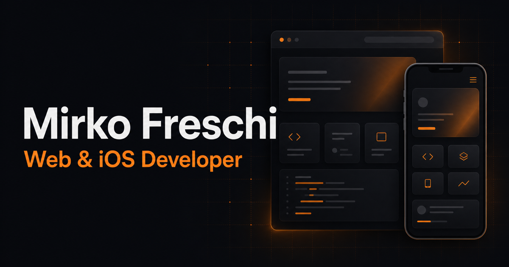

# Mirko Freschi — Developer Portfolio

A modern personal portfolio showcasing my work, technical skills, professional journey, certifications, and services as a Web and iOS Developer.

The project was designed and developed from scratch with a strong focus on clean presentation, responsive layouts, maintainable code, accessibility, performance, and search-engine visibility. Each project has its own detail page, structured metadata, and social-sharing preview.



## Project highlights

- Responsive interface designed for mobile, tablet, and desktop devices.
- Reusable React components and data-driven project sections.
- Dedicated routes for services, projects, and the custom 404 page.
- Route-specific titles, descriptions, canonical URLs, Open Graph data, Twitter Cards, and JSON-LD.
- Automatically generated `sitemap.xml`, `robots.txt`, and `llms.txt` files.
- Project-specific social preview images.
- Self-hosted Inter and Sora variable fonts.
- Optimized WebP assets, lazy loading, and reduced-motion support.
- Scroll-based navigation and reveal animations.

## Technologies

| Area | Technologies |
| --- | --- |
| Front end | React 19, JavaScript, HTML5, CSS3 |
| Styling | Tailwind CSS 4, responsive design, custom CSS |
| Routing | React Router 7 |
| Tooling | Vite 8, npm, ESLint |
| SEO | Open Graph, Twitter Cards, JSON-LD, sitemap and static metadata generation |
| Deployment | Static production build ready for modern hosting platforms |

## Skills strengthened

Building this portfolio helped me improve and consolidate several areas of development:

- structuring a React application around reusable and maintainable components;
- managing client-side routing, URL state, anchors, and custom error pages;
- creating responsive layouts with a mobile-first approach;
- designing a consistent visual system with reusable colors, typography, spacing, and components;
- improving accessibility through semantic markup, keyboard focus states, reduced-motion support, and descriptive content;
- optimizing images, fonts, assets, and production bundles;
- implementing technical SEO and route-specific social metadata;
- automating production tasks with custom Node.js scripts;
- organizing project data separately from presentation components to simplify future updates.

## Run locally

Node.js `20.19+` or `22.12+` is recommended.

```bash
git clone https://github.com/Sc0rpii/Portfolio.git
cd Portfolio
npm install
npm run dev
```

Vite will print the local development URL in the terminal.

## Production build

Create `.env.production` from `.env.example` and configure the final public URL:

```env
VITE_SITE_URL=https://mirkofreschi.com/
```

Then verify and build the project:

```bash
npm run lint
npm run build
npm run preview
```

The optimized production output is generated in `dist/`.

## Available scripts

| Command | Purpose |
| --- | --- |
| `npm run dev` | Start the development server |
| `npm run lint` | Run the ESLint checks |
| `npm run build` | Generate SEO files and create the production build |
| `npm run preview` | Preview the production build locally |

## Visit the portfolio

Explore the finished portfolio at **[mirkofreschi.com](https://mirkofreschi.com/)**.
